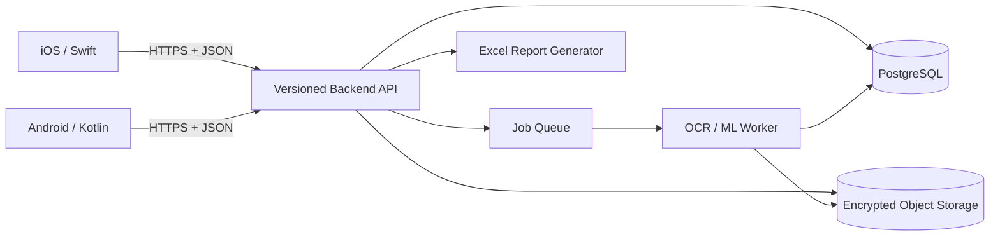

# 00-01 — Hedef Mimari

## 1. Mimari İlkeler

1. iOS ve Android yalnızca istemcidir; iş kuralları ortak backend'de yaşar.
2. API sözleşmesi ve veritabanı şeması sürümlenir.
3. Model çıktısı öneridir; düşük güven veya doğrulama hatasında öğretim elemanı
   sonucu görür, düzeltir ve onaylar.
4. Aynı kâğıdın ağ hatası nedeniyle tekrar gönderilmesi mükerrer sonuç
   üretmez (idempotent yükleme).
5. Ham kâğıt görüntüsü PostgreSQL'e yazılmaz. Şifreli nesne deposunda tutulur;
   PostgreSQL yalnızca nesne anahtarı, özet (hash) ve işlem durumunu saklar.
6. Puan ve PÇ hesaplarında onaylı veritabanı kayıtları tek doğruluk kaynağıdır.

## 2. Bağlam



## 3. Bileşenler

### Mobil istemciler

- iOS uygulaması Swift ve SwiftUI; Android uygulaması Kotlin ve Jetpack
  Compose ile ayrı geliştirilebilir.
- Ortak davranış: giriş, bağlam seçimi, sınav tanımı, kamera yakalama, kalite
  kontrolü, kuyruk görünümü, sonuç doğrulama/düzeltme ve rapor indirme.
- Ortak kod zorunlu değildir; API OpenAPI belgesinden üretilen istemciler ve
  ortak fixture/sözleşme testleri davranış eşitliğini korur.
- Çevrimdışı yakalama ileriki sürüme bırakılır. İlk sürüm ağ kesilince güvenli
  yerel kuyrukta bekletip bağlantı geldiğinde tekrar gönderir.

### Backend API

- Önerilen başlangıç: Python 3.11+, FastAPI, SQLAlchemy/Alembic ve Pydantic.
- Kimlik doğrulama kısa ömürlü erişim belirteci + yenileme belirteciyle yapılır;
  parola özeti Argon2id veya bcrypt olmalıdır.
- Her sorgu authenticated kullanıcının kurum/ders yetkisini kontrol eder.
- Uzun süren OCR işlemi HTTP isteği içinde çalışmaz; iş kuyruğuna verilir.
- API tabanı `/api/v1`; hata yanıtları sabit hata kodu ve correlation ID taşır.

### OCR/ML worker

- Görüntü kalite kontrolü, sayfa hizalama, öğrenci numarası ve soru bölgesi
  çıkarımı, el yazısı/rakam tanıma ve güven skoru üretir.
- Model sürümü her okuma sonucuyla kaydedilir.
- Soru sayısını model sabitlemez; sınavın `exam_questions` kayıtları belirler.
- Güven eşiğinin altındaki öğrenci kimliği veya puan, `needs_review` durumuna
  düşer. Otomatik olarak kesin not kabul edilmez.

### PostgreSQL

- Akademik yapı, yetkiler, sınav tanımları, soru–PÇ ağırlıkları, okuma işi,
  onaylı puanlar, rapor işleri ve denetim olaylarını saklar.
- Tenant sınırı `institution_id` üzerinden uygulanır. İlk sürüm tek kurumla
  çalışsa bile şema çoklu kuruma hazırdır.

### Nesne deposu

- S3 uyumlu özel bucket önerilir. Nesneler rastgele anahtarlarla, sunucu tarafı
  şifrelemeyle ve süreli erişim URL'leriyle kullanılır.
- Bucket herkese açık olmaz; istemci görseli doğrudan kalıcı URL ile paylaşmaz.

## 4. Temel Akışlar

### Seri kâğıt okuma

1. Kullanıcı akademik yıl → dönem → ders → sınav seçer.
2. İstemci her kâğıt için benzersiz `client_request_id` üretir ve yükler.
3. API erişimi doğrular, görüntüyü nesne deposuna koyar, `scan_jobs` kaydı açar
   ve hemen `202 Accepted` döner.
4. Worker görüntüyü işler; sayfa ve tahmin kayıtlarını oluşturur.
5. Kullanıcı polling veya bildirimle sonucu açar; belirsiz alanları düzeltir.
6. Onay isteği tek transaction içinde cevapları ve toplamı kesinleştirir,
   durumu `saved` yapar.
7. API `saved_at` ile “okundu ve kaydedildi” sonucunu döner.

### PÇ analizi

Bir sorunun onaylı öğrenci puanı, sorunun PÇ ağırlıklarına dağıtılır. Bir PÇ
için başarı yüzdesi:

```text
100 × Σ(öğrenci_soru_puanı × PÇ_ağırlığı)
      / Σ(soru_azami_puan × PÇ_ağırlığı)
```

Payda yalnızca analize dahil edilen öğrenciler ve sorular için hesaplanır.
Yuvarlama rapor sunumunda yapılır; veritabanında ham `numeric` değer korunur.

## 5. Durum Makineleri

`scan_jobs`:

```text
queued → processing → needs_review → saved
                   └→ failed
queued/failed → cancelled
```

`exam_papers`: `processing → needs_review → confirmed`; hatalı/eşleşmeyen kâğıt
`rejected` olabilir. Onaylı kayıt doğrudan silinmez; düzeltme audit olayıyla
yapılır.

## 6. Güvenlik ve Gizlilik

- TLS zorunlu; production secret'ları repoda tutulmaz.
- Öğretim elemanı sadece yetkilendirildiği derslerin öğrenci ve sınavlarını
  görür. Yönetici kapsam ataması yapabilir.
- Öğrenci numarası uygulama ekranlarında gerektiği kadar gösterilir; rapor
  yetkisi ayrıca kontrol edilir.
- Puan değişikliklerinde önceki/yeni değer, aktör, zaman ve gerekçe tutulur.
- Saklama süresi kurum politikasıyla belirlenir; silme hem nesne deposunu hem
  ilişkili kişisel veriyi kapsar.
- Loglarda parola, token, ham görsel, öğrenci adı veya tam öğrenci numarası
  bulunmaz.

## 7. Dağıtım ve Gözlemlenebilirlik

- Yerel geliştirme: API + worker + PostgreSQL + S3 uyumlu servis.
- Production: API ve worker ayrı süreçler; yönetilen PostgreSQL ve özel nesne
  deposu; günlük yedek ve geri yükleme testi.
- Her istek `correlation_id`; her model çalışması `model_version`; metrikler:
  kuyruk süresi, işlem süresi, hata oranı, insan düzeltme oranı ve güven dağılımı.
- Sağlık uçları canlılık ve hazır olma kontrolünü ayırır.

## 8. İlk API Yüzeyi

| Yöntem | Uç | Amaç |
|---|---|---|
| `POST` | `/api/v1/auth/login` | Oturum açma |
| `GET` | `/api/v1/academic-contexts` | Yıl/dönem/ders listesi |
| `GET/POST` | `/api/v1/courses/{id}/exams` | Sınav listeleme/tanımlama |
| `POST` | `/api/v1/exams/{id}/scans` | Kâğıt yükleme ve iş başlatma |
| `GET` | `/api/v1/scans/{id}` | İş ve tahmin durumunu okuma |
| `POST` | `/api/v1/papers/{id}/confirm` | Düzeltip kesinleştirme |
| `GET` | `/api/v1/exams/{id}/po-analysis` | PÇ analizi |
| `POST` | `/api/v1/exams/{id}/exports` | Excel rapor işi başlatma |

OpenAPI belgesi backend uygulaması başladığında sözleşmenin kaynağı olacaktır.

## 9. Kabul Edilen ve Ertelenen Kararlar

Kabul edilenler: ortak backend/veritabanı/model; native Swift ve Kotlin
istemciler; PostgreSQL; asenkron OCR; insan onayı; nesne deposu; dinamik soru
modeli.

İlk sürüm sonrasına ertelenenler: öğrenci bilgi sistemi entegrasyonu, tam
çevrimdışı çalışma, öğrenci portalı, birden çok sayfa şablonunun otomatik keşfi
