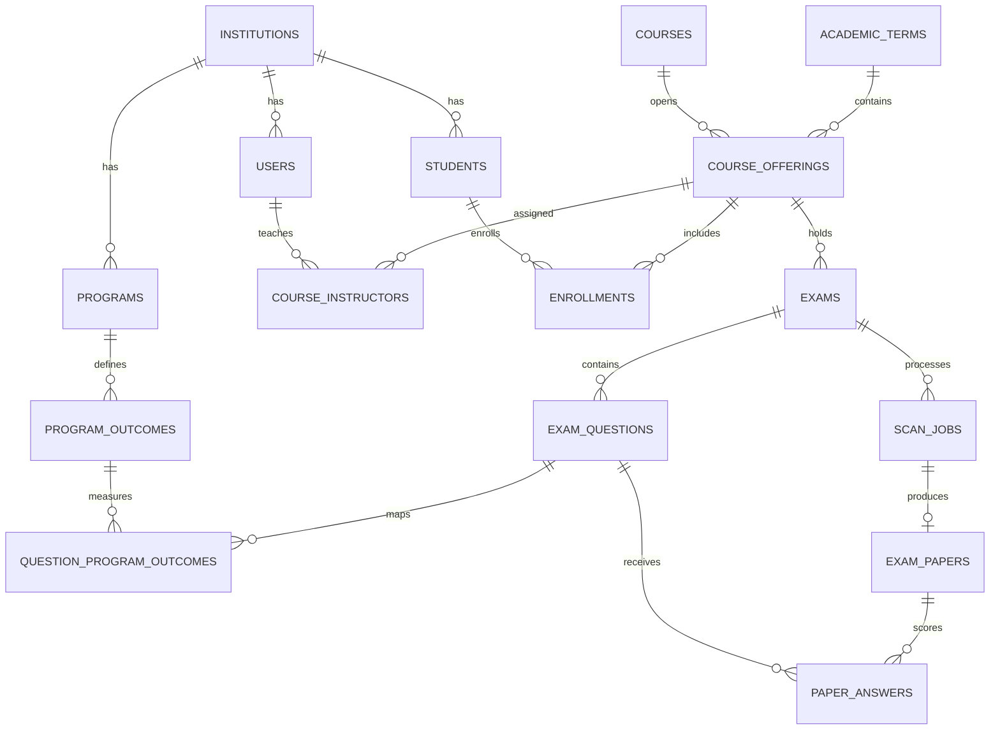

# 00-02 — PostgreSQL Database Design

## Amaç

Şema; akademik bağlamı, yetkilendirmeyi, dinamik sınav sorularını, Soru–PÇ
ilişkilerini, asenkron kâğıt okuma işlerini, kesin puanları ve rapor işlerini
normalleştirilmiş biçimde saklar. İlk migration:
[`database/migrations/001_initial_schema.sql`](../database/migrations/001_initial_schema.sql).

## Varlık Grupları

| Grup | Tablolar |
|---|---|
| Kimlik/yetki | `institutions`, `users`, `course_instructors` |
| Akademik yapı | `academic_terms`, `programs`, `courses`, `course_offerings`, `students`, `enrollments` |
| Sınav/PÇ | `program_outcomes`, `exams`, `exam_questions`, `question_program_outcomes` |
| Okuma/puan | `scan_jobs`, `exam_papers`, `paper_answers` |
| Rapor/denetim | `export_jobs`, `audit_events` |

## Temel İlişkiler



## Tasarım Kararları

- Anahtarlar UUID ve PostgreSQL `gen_random_uuid()` ile üretilir.
- E-posta büyük/küçük harf duyarsız `citext` olarak saklanır.
- İnsan tarafından okunan kodlar kurum/program kapsamında benzersizdir.
- Sınav soruları satır bazlıdır; soru sayısı veya kolon sayısı şemaya gömülmez.
- PÇ çoktan-çoğa ilişkisi ağırlıkla modellenir.
- Puanlar `numeric(8,3)` ile saklanır; kayan nokta hatası rapora taşınmaz.
- Tahmin ve kesin değer ayrı kolonlardır. Model kesin değeri sessizce ezemez.
- `scan_jobs.client_request_id`, ağ tekrarı halinde aynı kullanıcı için
  idempotency sağlar.
- Bir sınav/öğrenci için yalnızca bir etkin (`processing`, `needs_review`,
  `confirmed`) kâğıda izin veren partial unique index vardır.
- `updated_at` tetikleyicisi değişebilir ana tablolarda zamanı günceller.
- Soru–PÇ ağırlık toplamı, çok satırlı değişikliklere izin vermek için deferred
  constraint trigger ile transaction sonunda doğrulanır.
- Audit payload'ları esnek olay ayrıntısı için `jsonb`; temel iş verileri ise
  sorgulanabilir kolonlarda tutulur.

## Bütünlük Kuralları

- Akademik başlangıç yılı makul aralıktadır ve kurum/yıl/dönem tektir.
- Ders açılışı aynı dönem/program/ders/şube kombinasyonunda tektir.
- Sınav türü, iş ve kâğıt durumları enum ile sınırlıdır.
- Soru sırası sınav içinde tektir; azami puan pozitiftir.
- Cevap puanı soruyla aynı sınava ait olmalıdır ve azami puanı aşamaz; bu kural
  `validate_paper_answer()` tetikleyicisiyle korunur.
- Onaylı kâğıt öğrenciyle eşleşmiş olmalıdır.
- Soru–PÇ eşlemesi aynı program içindeki PÇ'leri kullanmalıdır; API/service
  katmanı bu kapsamı doğrular, veritabanı migration'ı temel FK'leri uygular.
- Soru puanları toplamının sınav toplamına eşitliği sınav yayınlama akışında
  service katmanında doğrulanır; taslak oluştururken geçici eksik toplam mümkündür.

## PÇ Analizi Sorgu Taslağı

```sql
SELECT po.code,
       SUM(pa.final_score * qpo.weight) AS earned,
       SUM(eq.max_score * qpo.weight) AS possible,
       ROUND(
         100 * SUM(pa.final_score * qpo.weight)
         / NULLIF(SUM(eq.max_score * qpo.weight), 0),
         2
       ) AS success_percent
FROM exam_papers ep
JOIN paper_answers pa ON pa.exam_paper_id = ep.id
JOIN exam_questions eq ON eq.id = pa.exam_question_id
JOIN question_program_outcomes qpo ON qpo.exam_question_id = eq.id
JOIN program_outcomes po ON po.id = qpo.program_outcome_id
WHERE ep.exam_id = :exam_id
  AND ep.status = 'confirmed'
GROUP BY po.id, po.code
ORDER BY po.code;
```

## Migration Politikası

- Uygulanmış migration değiştirilmez; yeni değişiklik yeni sıralı dosyada gelir.
- Production migration yedek sonrası ve `ON_ERROR_STOP=1` ile uygulanır.
- Şema değişiklikleri önce geriye uyumlu ekleme, sonra uygulama geçişi, son
  aşamada eski alanı kaldırma şeklinde yapılır.
- Migration hem boş veritabanında hem bir önceki sürüm üzerinde CI'da test edilir.

## Sonraki 00-02 İşleri

- Kurumun kesin PÇ hesap yöntemiyle materialized view/rapor sorgusunu netleştirme
- Geliştirme seed verisi (gerçek öğrenci verisi olmadan)
- Rol/yetki matrisi kesinleşince PostgreSQL Row Level Security değerlendirmesi
- Docker tabanlı integration testinde migration ve constraint testleri
- Veri saklama süresine göre anonimleştirme/silme prosedürü
